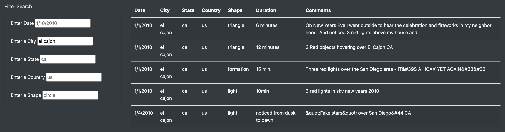

# UFO Sightings with JavaScript

## Project Overview & Purpose

---

Our client, a data journalist, Dana, is tasked with posting an article on the UFO sightings in McMinnville, Oregon. We are to help her display the sighting data on her article webpage, and create filters to help viewers sift thorugh it. In order to do this, we are building upon are knowledge of HTML/CSS, and adding the discussed functionalities through JavaScript.

 

## Results

---  

The webpage can be accessed through the [*index.html*](index.html) file. Here, is a screenshot of the webpage:
    

        
    
     

Let's take a closer look at the filters:
    

        
    

    
Each of the filters contain placeholders, so that viewers understand the format in which they'll need to enter information, so as to generate a filtered table.

To filter, simply type the parameter(s) by which you would like to filter in the respective field(s), and press enter or click on the screen. Here's an example of how the webpage changes on filtering:
    

        
    

In order to reset the table, either reload the page or delete the filter(s), and press enter or click on the screen.

 

## Summary

---

A major drawback or inconvenience with the webpage is the need to enter the text in the exact same format as in the table. For example, if we were to filter by the city *el cajon* but input it as *El cajon*, we'd get an empty table:

        

There's also a bit of impracticality to the way the filters are setup because the users will need to know the exact crtieria value- exact city, exact state, etc.- by which they'd want to filter their table.

In order to address these drawbacks, we'd like to propose two future recommendations:

1. Build a case insensitive functionality and account for spaces between cities with two or more words.

2. Model the filters as dropdowns and check-boxes rather than text fields, as it will allow viewers to quickly view their filter options instead of having to scroll through the table. This will also cover the previous recommendation as there wouldn't be a need to account for user input discrepancies. 